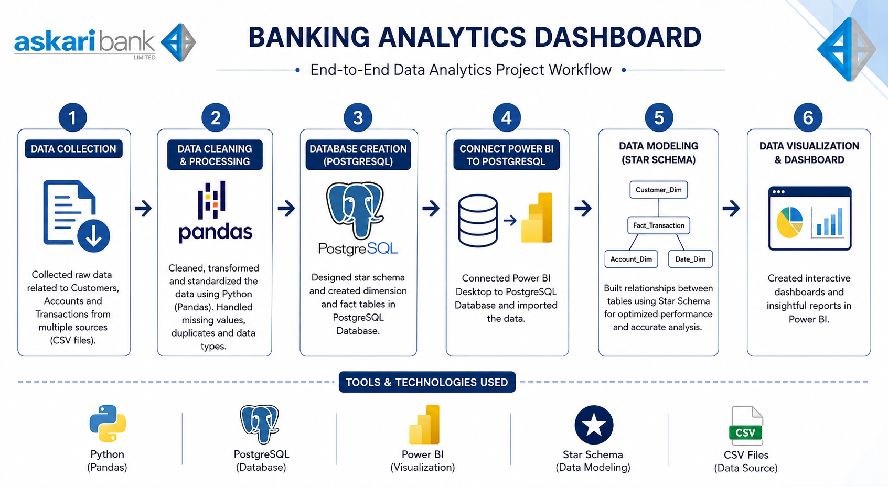
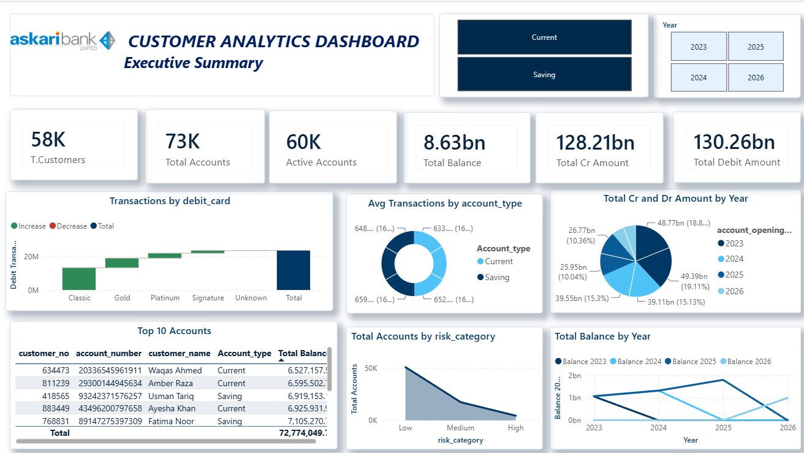
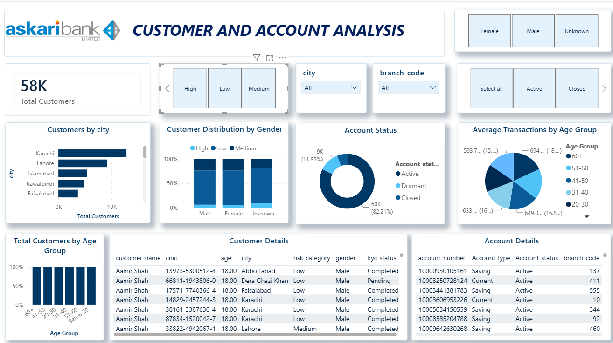
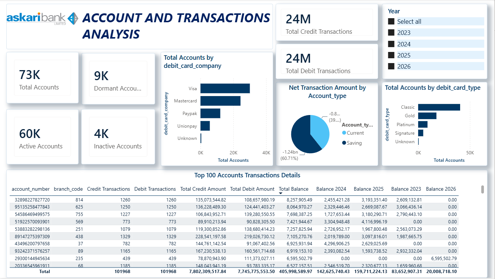

# 📊 Askari Bank Customer & Account Analytics Dashboard

## Overview

This project is an end-to-end Business Intelligence solution that demonstrates the complete data analytics workflow—from raw data preparation to interactive dashboard development.

The project simulates customer, account, and transaction data for a banking environment and showcases how Python, PostgreSQL, SQL, and Power BI can be integrated to generate meaningful business insights for decision-makers.


---

## Objectives


* Build a complete data analytics pipeline.
* Clean and preprocess raw banking data using Python.
* Store structured data in PostgreSQL.
* Perform SQL-based data validation and querying.
* Design an optimized data model for reporting.
* Develop interactive Power BI dashboards for executive and operational analysis.

---

## Tools & Technologies

* **Python**

  * Pandas
  * NumPy

* **Database**

  * PostgreSQL
  * pgAdmin

* **Visualization**

  * Microsoft Power BI
  * DAX
  * Power Query

* **Other Tools**

  * Git
  * GitHub
  * VS Code

---

## Project Workflow

Raw Banking Data (CSV)

⬇

Data Cleaning & Preprocessing (Python + Pandas)

⬇

Database Creation (PostgreSQL)

⬇

Data Import

⬇

SQL Validation & Analysis

⬇

Power BI Data Connection

⬇

Data Modeling (Star Schema)

⬇

DAX Measures & KPIs

⬇

Interactive Dashboard Development

---

## Data Cleaning Process

The following preprocessing steps were performed using Python:

* Removed duplicate records
* Handled missing values
* Standardized data types
* Validated customer identifiers
* Cleaned invalid dates
* Corrected inconsistent values
* Generated data quality statistics
* Prepared data for database import

---

## Database Design

The cleaned data was imported into PostgreSQL where relational tables were created and optimized for reporting.

The database was then connected directly to Power BI.

---

## Power BI Dashboard

The report contains three interactive pages:

### 1. Executive Summary

Provides an overview of overall banking performance including:

* Total Customers
* Total Accounts
* Total Deposits
* Total Balance
* Branch-wise Analysis
* Customer Distribution
* Yearly Trends




### 2. Customer & Account Analysis

Focuses on customer behaviour and account insights including:

* Gender Distribution
* Age Groups
* Marital Status
* Occupation Analysis
* Account Type
* Branch Performance
* Customer Segmentation




### 3. Account & Transaction Analysis

Provides financial performance insights such as:

* Total Transactions
* Deposits
* Withdrawals
* Average Balance
* Account Activity
* Transaction Trends
* Branch Comparison



## Key Skills Demonstrated

* Data Cleaning
* ETL Process
* Python Automation
* SQL
* PostgreSQL
* Power BI
* Data Modeling
* DAX
* Dashboard Design
* Business Intelligence
* Data Visualization

---

## Repository Structure

```text
Askari-Bank-Customer-Analytics
│
├── Data
├── Images
├── PowerBI
├── Python
├── SQL
├── README.md
└── LICENSE
```

---

## Dashboard Preview

Dashboard screenshots are available in the **Images** folder.

---

## Future Improvements

* Real-time database integration
* Incremental data refresh
* KPI alerts
* Forecasting using Python
* Machine Learning-based customer segmentation

---

## Disclaimer

This project is created solely for educational and portfolio purposes.

The dataset used in this repository is synthetic/anonymized and does not contain any confidential customer or banking information.

---

## Author

**Ammad Arshad**

Junior BI Developer

Passionate about Data Analytics, Business Intelligence, SQL, Python, PostgreSQL, and Power BI.
